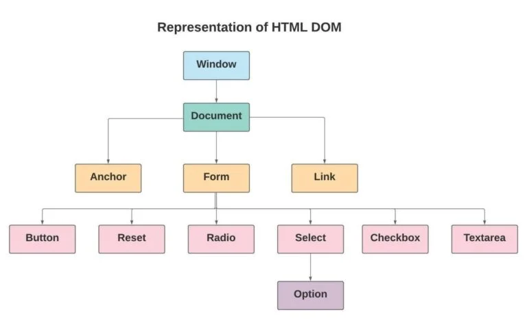

# **_Blog On The Difference Between Document and Window Objects_**


# **Window Object**

  + The window object is the global object that contains all the properties and methods available to the current window or frame.
  + It represents a browser window or frame that displays the contents of the webpage.   
  + It is the very first object that is loaded in the browser.
  + It is the object of the browser.
  + Global objects, functions, and variables of JavaScript are members of the window object.
  + We can access the window from the window only. i.e. window.window
  + The window is part of BOM, not DOM.
  + Properties of the window object cannot be accessed by the document object.
  + ~~syntax~~:
      ```window.propertyname;```
  + example:
      window.innerHeight : will return the height of the content area of the browser.  




# **Document Object**

  + he document object is a property of the window object that represents the DOM (document object model) of the current web page.
  + It represents any HTML document or web page that is loaded in the browser.
  + It is loaded inside the window.
  + It is the object of window property.
  + All the tags, elements with attributes in HTML are part of the document.
  + We can access the document from a window using the window. document.
  + The document is part of BOM (browser object model) and dom (Document object model).
  + Properties of document objects such as title, body, cookies, etc can also be accessed by a window like this window. document.title.
  + ~~syntax~~:
      ```document.propertyname;``` 
  + example:
     document.title :  will return the title of the document.


    
